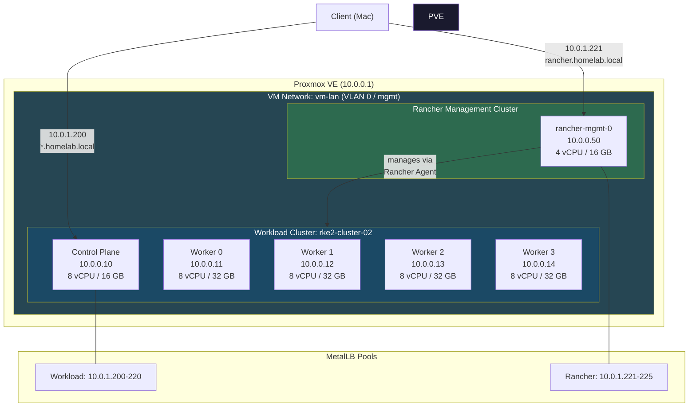
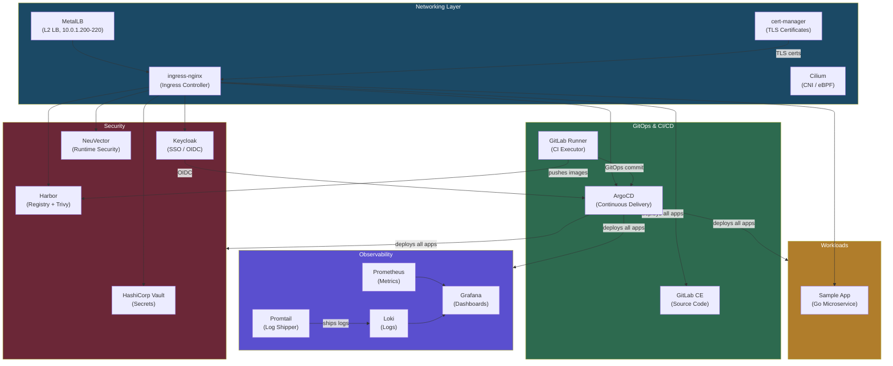
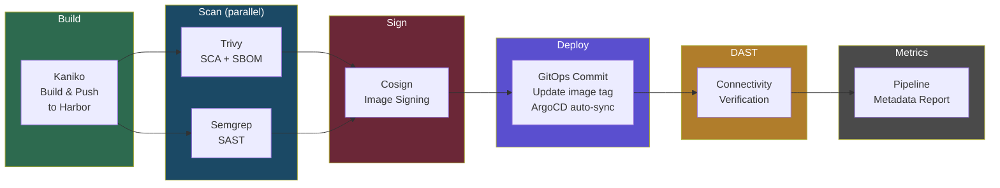
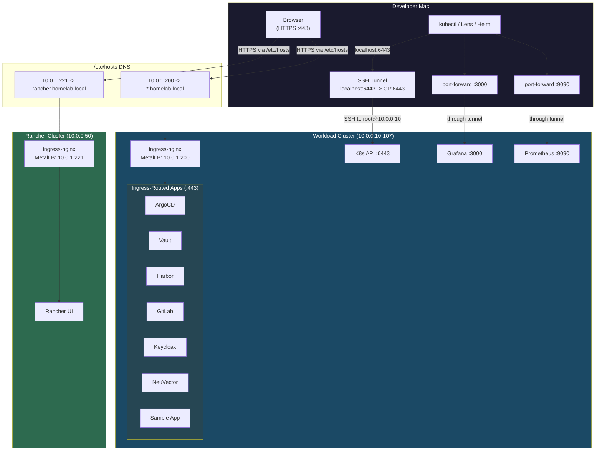
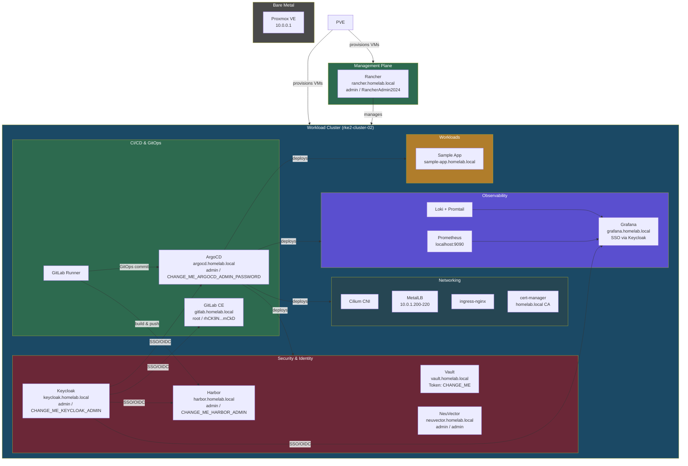
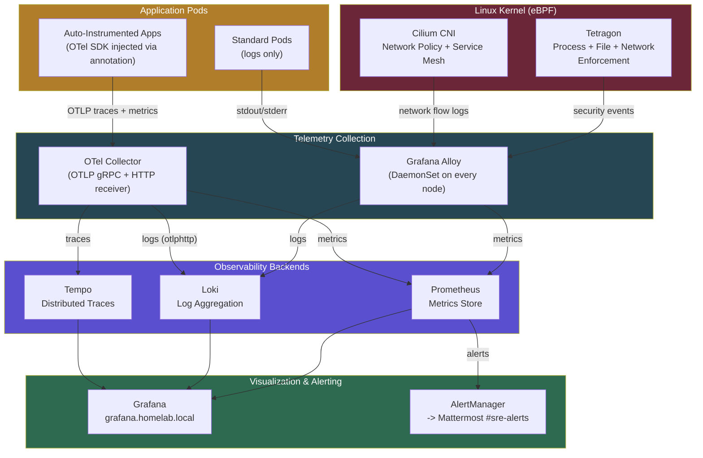
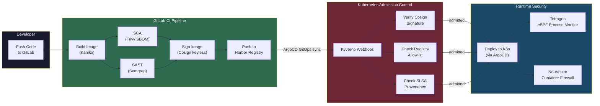
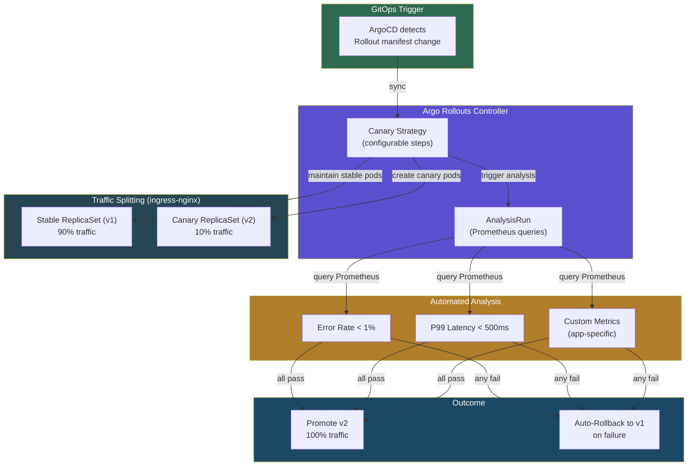
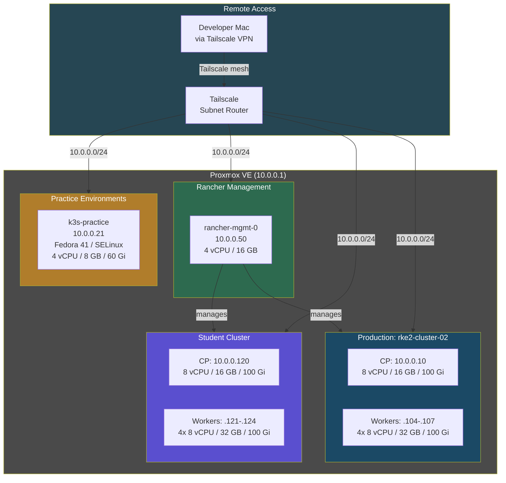

# DevSecOps Infrastructure Platform

A complete, production-grade DevSecOps platform deployed on-premises using **Proxmox VE** as the hypervisor, **RKE2** as the CNCF-conformant Kubernetes distribution, and **ArgoCD** for GitOps-driven continuous delivery. Every component -- from the bare-metal VM provisioning through Terraform to the application CI/CD pipeline running on GitLab -- is defined as code in this repository.

---

## Table of Contents

1. [Project Overview](#project-overview)
2. [Architecture](#architecture)
3. [Architecture Diagrams](#architecture-diagrams)
4. [Technology Stack](#technology-stack)
5. [Tool Definitions](#tool-definitions)
6. [Application Deployment Order (ArgoCD Sync Waves)](#application-deployment-order-argocd-sync-waves)
7. [Network Configuration](#network-configuration)
8. [Rancher Management Cluster](#rancher-management-cluster)
9. [CI/CD Pipeline](#cicd-pipeline)
10. [Credentials and Access](#credentials-and-access)
11. [Access URLs](#access-urls)
12. [Prerequisites for Mac Access](#prerequisites-for-mac-access)
13. [Quick Start](#quick-start)
14. [Terraform Variables](#terraform-variables)
15. [Known Issues and Solutions](#known-issues-and-solutions)
16. [Application Documentation](#application-documentation)
17. [Tutorials](#tutorials)
18. [Directory Structure](#directory-structure)

---

## Project Overview

This repository contains the Infrastructure-as-Code (IaC) and GitOps manifests for a fully self-hosted DevSecOps platform. The platform is designed to demonstrate an end-to-end secure software delivery lifecycle on a single on-premises Proxmox VE cluster.

**What this platform provides:**

- **Infrastructure Provisioning** -- Terraform provisions Ubuntu 22.04 virtual machines on Proxmox VE with static IP addressing and cloud-init based RKE2 bootstrap.
- **Kubernetes** -- An RKE2 cluster (1 control plane + 4 workers) with Cilium CNI for network policy enforcement and eBPF-based networking.
- **GitOps** -- ArgoCD manages all cluster applications through an App-of-Apps pattern. Every application is defined declaratively and auto-synced from this Git repository.
- **Full CI/CD** -- GitLab CE with GitLab Runner provides the pipeline engine. The sample application pipeline covers build, SCA, SAST, image signing, GitOps deployment, and DAST.
- **Security** -- NeuVector for runtime container security, HashiCorp Vault for secrets management, Cosign for image signing, Trivy for vulnerability scanning, and Semgrep for static analysis.
- **Observability** -- Prometheus + Grafana for metrics, Loki for log aggregation, Tempo for distributed tracing, Grafana Alloy for unified telemetry collection.
- **Identity** -- Keycloak provides SSO/OIDC with a pre-configured `homelab` realm, integrated with ArgoCD, Grafana, Harbor, GitLab, Mattermost, and JupyterHub for centralized single sign-on.
- **Container Registry** -- Harbor with built-in Trivy scanning serves as the private container registry.
- **Multi-Cluster Management** -- Rancher on a dedicated single-node cluster provides centralized management of all workload clusters.
- **AI/MLOps Platform** -- Ollama for LLM inference, Open WebUI for ChatGPT-like interaction, JupyterHub for multi-user notebooks, MLflow for experiment tracking, and MinIO for S3-compatible object storage.
- **TLS Everywhere** -- cert-manager with a self-signed CA (`homelab.local CA`) issues TLS certificates for all ingresses automatically.
- **DNS** -- A standalone CoreDNS instance serves `*.homelab.local` records via MetalLB (`10.0.1.210`), eliminating manual `/etc/hosts` entries for clients that use it as a DNS server or conditional forwarder.
- **Vault Auto-Unseal** -- Vault automatically unseals after pod restarts using a Kubernetes Secret-mounted unseal key and a postStart lifecycle hook.
- **Remote Access** -- Tailscale subnet router advertises the lab network (`10.0.0.0/24`), pod CIDR (`10.42.0.0/16`), and service CIDR (`10.43.0.0/16`) for secure remote access without SSH tunnels.
- **eBPF Runtime Security** -- Tetragon provides kernel-level process observability, file integrity monitoring, and network enforcement across all nodes, extending the existing Cilium eBPF foundation.
- **Progressive Delivery** -- Argo Rollouts enables canary and blue-green deployments with Prometheus-driven automated analysis and a dedicated dashboard at `rollouts.homelab.local`.
- **Supply Chain Security** -- Cosign image verification and Kyverno policies enforce trusted registries, image signatures, and SLSA provenance attestations (audit mode by default).
- **Auto-Instrumentation** -- OpenTelemetry Operator automatically instruments Python, Java, Node.js, and Go applications, sending traces to Tempo, metrics to Prometheus, and logs to Loki via a centralized OTel Collector.
- **Cloud-Native PostgreSQL** -- CloudNativePG operator provides Kubernetes-native PostgreSQL with automated failover, continuous backup, and Grafana monitoring dashboards.
- **Multi-Cluster** -- Student cluster (1 CP + 4 workers) and k3s practice VM (Fedora 41 / SELinux) provide isolated environments for training and experimentation.

---

## Architecture

```
+===========================================================================+
|                        PROXMOX VE  (10.0.0.1)                      |
|                     Bare-Metal Hyperconverged Infrastructure              |
|  +---------------------------------------------------------------------+  |
|  |                                                                     |  |
|  |                     VM Network: vm-lan (VLAN 0 / mgmt)              |  |
|  |                     Gateway: 10.0.0.1                            |  |
|  |                     DNS: 10.0.0.1, 8.8.8.8                       |  |
|  |                                                                     |  |
|  |  +--------------------------------------------------------------+  |  |
|  |  | RANCHER MANAGEMENT CLUSTER (rancher-mgmt)                    |  |  |
|  |  |                                                              |  |  |
|  |  |  +------------------+                                        |  |  |
|  |  |  | rancher-mgmt-0   |   Rancher UI: https://rancher.homelab.local
|  |  |  | 10.0.0.50     |   MetalLB Pool: 10.0.1.221-225     |  |  |
|  |  |  | 4 vCPU / 16 GB   |   RKE2 Server (single-node)           |  |  |
|  |  |  | Ubuntu 22.04     |   cert-manager + ingress-nginx         |  |  |
|  |  |  | 40Gi disk        |                                        |  |  |
|  |  |  +------------------+                                        |  |  |
|  |  +--------------------------------------------------------------+  |  |
|  |                          | manages                                 |  |
|  |                          v                                         |  |
|  |  +--------------------------------------------------------------+  |  |
|  |  | WORKLOAD CLUSTER (rke2-cluster-02)                           |  |  |
|  |  |                                                              |  |  |
|  |  |  +------------------+ +------------------+ +------------------+  |
|  |  |  | Control Plane    | | Worker 0         | | Worker 1         |  |
|  |  |  | 10.0.0.10    | | 10.0.0.11    | | 10.0.0.12    |  |
|  |  |  | 8 vCPU / 16 GB   | | 8 vCPU / 32 GB   | | 8 vCPU / 32 GB   |
|  |  |  | RKE2 Server      | | RKE2 Agent       | | RKE2 Agent       |  |
|  |  |  +------------------+ +------------------+ +------------------+  |
|  |  |                                                              |  |  |
|  |  |  +------------------+ +------------------+                   |  |  |
|  |  |  | Worker 2         | | Worker 3         |                   |  |  |
|  |  |  | 10.0.0.13    | | 10.0.0.14    |                   |  |  |
|  |  |  | 8 vCPU / 32 GB   | | 8 vCPU / 32 GB   |                   |  |  |
|  |  |  | RKE2 Agent       | | RKE2 Agent       |                   |  |  |
|  |  |  +------------------+ +------------------+                   |  |  |
|  |  +--------------------------------------------------------------+  |  |
|  |                                                                     |  |
|  +---------------------------------------------------------------------+  |
+===========================================================================+

+===========================================================================+
|                   RKE2 KUBERNETES CLUSTER  (v1.28.13+rke2r1)              |
|                                                                           |
|  CNI: Cilium (disabled default, installed separately)                     |
|                                                                           |
|  +---------------------------------------------------------------------+  |
|  |  NETWORKING LAYER                                                   |  |
|  |                                                                     |  |
|  |  MetalLB (L2 mode)          ingress-nginx                          |  |
|  |  Pool: 10.0.1.200-220    Type: LoadBalancer                     |  |
|  |  Speaker on all nodes       Default IngressClass: nginx            |  |
|  |  (incl. control plane)                                             |  |
|  +---------------------------------------------------------------------+  |
|                                                                           |
|  +---------------------------------------------------------------------+  |
|  |  CERTIFICATE MANAGEMENT                                             |  |
|  |                                                                     |  |
|  |  cert-manager  -->  ClusterIssuer: selfsigned-bootstrap             |  |
|  |                -->  CA Certificate: homelab.local CA (RSA 4096)      |  |
|  |                -->  ClusterIssuer: homelab-ca-issuer               |  |
|  |                     (issues TLS certs for all ingresses)            |  |
|  +---------------------------------------------------------------------+  |
|                                                                           |
|  +---------------------------------------------------------------------+  |
|  |  PLATFORM APPLICATIONS                                              |  |
|  |                                                                     |  |
|  |  ArgoCD ........... GitOps continuous delivery (argocd namespace)   |  |
|  |  Prometheus ....... Metrics collection + alerting (monitoring ns)   |  |
|  |  Grafana .......... Dashboards + visualization (monitoring ns)      |  |
|  |  Loki ............. Log aggregation (monitoring ns)                 |  |
|  |  Promtail ......... Log shipping agent (monitoring ns)             |  |
|  |  Keycloak ......... Identity / SSO / OIDC (keycloak ns)           |  |
|  |  Vault ............ Secrets management (vault ns)                  |  |
|  |  Harbor ........... Container registry + Trivy (harbor ns)        |  |
|  |  NeuVector ........ Runtime security (neuvector ns)               |  |
|  |  GitLab CE ........ Source code management (gitlab ns)            |  |
|  |  GitLab Runner .... CI/CD executor (gitlab-runners ns)            |  |
|  |  Sample App ....... Demo Go application (sample-app ns)           |  |
|  +---------------------------------------------------------------------+  |
+===========================================================================+

+===========================================================================+
|                         EXTERNAL ACCESS                                   |
|                                                                           |
|  Client (Mac) ---> /etc/hosts ---> 10.0.1.200 ---> MetalLB LB IP     |
|                                        |                                  |
|                                        v                                  |
|                                  ingress-nginx                            |
|                                        |                                  |
|           +----------------------------+----------------------------+     |
|           |           |           |          |          |           |     |
|           v           v           v          v          v           v     |
|        ArgoCD     Vault      Harbor    GitLab    Keycloak    NeuVector   |
|        :443       :443       :443      :443      :443        :443       |
|                                                                           |
|  *.homelab.local  (self-signed TLS via cert-manager)                      |
+===========================================================================+
```

---

## Architecture Diagrams

### Infrastructure Topology



### DevSecOps Application Stack



### CI/CD Pipeline Flow



### Client Access Architecture



### Complete Platform Overview



### eBPF Security and Observability Pipeline



### Supply Chain Security Flow



### Progressive Delivery with Argo Rollouts



### Multi-Cluster Architecture



---

## Technology Stack

| Technology | Role | Version / Chart Version | Namespace |
|---|---|---|---|
| **Proxmox VE** | Bare-metal hyperconverged infrastructure | Terraform provider >= 0.6.0 | N/A (hypervisor) |
| **Terraform** | Infrastructure as Code | >= 1.5.0 | N/A (client-side) |
| **Ubuntu** | VM operating system (cloud image) | 22.04 LTS | N/A (VM OS) |
| **RKE2** | CNCF Kubernetes distribution | v1.28.13+rke2r1 | N/A (cluster) |
| **Cilium** | CNI plugin (eBPF networking + network policy) | Bundled with RKE2 (cni: none, installed separately) | kube-system |
| **MetalLB** | L2 load balancer for bare-metal | Chart 0.14.x | metallb-system |
| **ingress-nginx** | Ingress controller | Chart 4.x | ingress-nginx |
| **cert-manager** | X.509 certificate management | Chart v1.16.x | cert-manager |
| **ArgoCD** | GitOps continuous delivery | Chart 9.x | argocd |
| **Prometheus** | Metrics collection and alerting | kube-prometheus-stack Chart 65.x | monitoring |
| **Grafana** | Metrics dashboards and visualization | Bundled with kube-prometheus-stack | monitoring |
| **Loki** | Log aggregation | loki-stack Chart 2.10.x | monitoring |
| **Promtail** | Log shipping agent | Bundled with loki-stack | monitoring |
| **Keycloak** | Identity provider / SSO / OIDC | Bitnami Chart 25.x (Keycloak 26.3.3) | keycloak |
| **HashiCorp Vault** | Secrets management | Chart 0.28.x | vault |
| **Harbor** | Container registry with Trivy scanning | Chart 1.15.x | harbor |
| **NeuVector** | Runtime container security | Core Chart 2.7.x | neuvector |
| **GitLab CE** | Source code management | Chart 8.x (Community Edition) | gitlab |
| **GitLab Runner** | CI/CD pipeline executor | Chart 0.71.x | gitlab-runners |
| **Sample App** | Demo Go microservice | Custom Helm chart 0.1.0 | sample-app |
| **Kaniko** | In-cluster container image builds | gcr.io/kaniko-project/executor:debug | gitlab-runners (CI) |
| **Trivy** | Container vulnerability scanning + SBOM | v0.50.0 | gitlab-runners (CI) |
| **Semgrep** | Static application security testing (SAST) | Latest via pip | gitlab-runners (CI) |
| **Cosign** | Container image signing (Sigstore) | v2.2.4 | gitlab-runners (CI) |
| **Rancher** | Multi-cluster Kubernetes management | Helm chart (stable) | cattle-system (rancher-mgmt cluster) |
| **Ollama** | LLM inference server | Chart 1.x | ai-platform |
| **Open WebUI** | ChatGPT-like web UI for LLMs | Chart 6.x | ai-platform |
| **JupyterHub** | Multi-user Jupyter notebooks | Chart 4.x | ai-platform |
| **MLflow** | ML experiment tracking | Chart 0.x | ai-platform |
| **MinIO** | S3-compatible object storage | Chart 5.x | minio |
| **Tetragon** | eBPF runtime security (process, file, network enforcement) | Chart 1.x | kube-system |
| **Argo Rollouts** | Progressive delivery (canary, blue-green, analysis) | Chart 2.x | argo-rollouts |
| **OpenTelemetry Operator** | Auto-instrumentation and telemetry collection | Chart 0.x | opentelemetry |
| **CloudNativePG** | Kubernetes-native PostgreSQL operator (HA, backup, failover) | Chart 0.x | cnpg-system |
| **Cosign + Kyverno Policies** | Container image signing verification and supply chain policies | Kyverno ClusterPolicies | kyverno |

---

## Tool Definitions

### Infrastructure

**Proxmox VE** -- An open-source open-source virtualization platform based on KVM and LXC. Provides VM management, storage, and networking on bare-metal servers. Used as the foundation layer to host all VMs that form the RKE2 clusters, eliminating the need for separate hypervisor and storage solutions.

**Terraform** -- A declarative Infrastructure-as-Code (IaC) tool by HashiCorp. Provisions and manages Proxmox VMs, cloud-init snippets, and storage through the Proxmox Terraform provider (bpg/proxmox). All infrastructure is defined in `.tf` files, enabling reproducible, version-controlled deployments.

**RKE2** -- Rancher Kubernetes Engine 2, a CNCF-conformant Kubernetes distribution focused on security and compliance. Deployed on all VMs via cloud-init. The workload cluster runs 1 control plane + 4 workers; the Rancher management cluster runs a single node. RKE2 provides built-in etcd, containerd, and FIPS-compliant binaries.

**Cilium** -- An eBPF-based CNI (Container Network Interface) plugin providing networking, load balancing, and network policy enforcement. Installed separately on the workload cluster (RKE2 configured with `cni: none`) to leverage eBPF for high-performance, kernel-level packet processing without iptables.

**MetalLB** -- A load balancer implementation for bare-metal Kubernetes clusters. Operates in L2 (ARP) mode to assign real IP addresses to LoadBalancer-type services. The workload cluster uses pool `10.0.1.200-220`; the Rancher cluster uses pool `10.0.1.221-225`.

**ingress-nginx** -- A Kubernetes Ingress controller based on NGINX. Routes external HTTPS traffic to internal services based on hostname (`Host` header). Receives a MetalLB LoadBalancer IP and terminates TLS using certificates issued by cert-manager.

**cert-manager** -- A Kubernetes-native certificate management controller. Automates the issuance and renewal of TLS certificates. Configured with a self-signed CA chain (`homelab.local CA`) that issues certificates for all `*.homelab.local` ingresses via the `homelab-ca-issuer` ClusterIssuer.

### GitOps & CI/CD

**ArgoCD** -- A declarative GitOps continuous delivery tool for Kubernetes. Watches this Git repository and automatically synchronizes Kubernetes resources to match the declared state. Uses an App-of-Apps pattern with sync-wave annotations to deploy all 16 applications in dependency order.

**GitLab CE** -- GitLab Community Edition, a self-hosted Git repository manager and DevOps platform. Hosts the sample application source code and provides the CI/CD pipeline engine. Deployed on the workload cluster via ArgoCD.

**GitLab Runner** -- The CI/CD pipeline executor registered to the GitLab instance. Runs pipeline jobs inside Kubernetes pods using the Kubernetes executor. Executes build, scan, sign, deploy, DAST, and metrics stages.

**Kaniko** -- A tool for building container images inside Kubernetes without requiring a Docker daemon. Used in the CI build stage to build the sample application Docker image and push it to Harbor. Runs as `gcr.io/kaniko-project/executor:debug` in GitLab Runner pods.

**Trivy** -- An open-source vulnerability scanner by Aqua Security. Used in the CI scan stage for Software Composition Analysis (SCA) -- scans container images for HIGH/CRITICAL vulnerabilities and generates CycloneDX SBOMs. Also integrated into Harbor for on-push image scanning.

**Semgrep** -- A fast, open-source static application security testing (SAST) tool. Runs in the CI scan stage with `--config auto` to detect security vulnerabilities and code quality issues in the application source code. Runs in parallel with Trivy SCA.

**Cosign** -- A container image signing tool from the Sigstore project. Signs built container images with a cryptographic key in the CI sign stage, ensuring supply chain integrity. Signatures are stored alongside images in Harbor.

### Security & Identity

**Keycloak** -- An open-source identity and access management platform providing SSO and OIDC. Pre-configured with an `homelab` realm, integrated with ArgoCD, Grafana, Harbor, GitLab, Mattermost, and JupyterHub for centralized single sign-on. Users authenticate through Keycloak to access all platform applications with group-based permissions.

**HashiCorp Vault** -- A secrets management and data protection platform. Deployed in standalone mode with file-based storage. Provides centralized secrets management for the platform. Automatically unseals after pod restarts via a postStart lifecycle hook that reads the unseal key from a mounted Kubernetes Secret.

**Harbor** -- An open-source container registry with built-in vulnerability scanning (Trivy), image signing, and access control. Serves as the private registry for all container images built by the CI pipeline. Configured with self-signed TLS and accessed at `harbor.homelab.local`.

**NeuVector** -- A full-lifecycle container security platform providing runtime protection, network visibility, and compliance scanning. Deployed with enforcer (DaemonSet), controller, and scanner components. Monitors container behavior and network traffic for anomalies.

**Kyverno** -- A CNCF-graduated Kubernetes-native policy engine. Validates, mutates, and generates Kubernetes resources using declarative YAML policies. Enforces security best practices such as requiring non-root containers, blocking privileged pods, and mandating resource limits as an admission controller.

### Storage & Backup

**Longhorn** -- A CNCF-graduated distributed block storage system for Kubernetes. Provides replicated, highly available persistent volumes with a built-in UI for volume management, snapshots, and backups. Configured with 2 replicas per volume and accessible at `https://longhorn.homelab.local`.

**Velero** -- An open-source tool for Kubernetes backup, restore, and disaster recovery. Configured with MinIO as the S3-compatible backup target with daily scheduled backups at 2:00 AM UTC (7-day retention). Supports full cluster backup including persistent volumes via the node agent.

### Observability

**Prometheus** -- A time-series metrics collection and alerting system. Deployed via the kube-prometheus-stack Helm chart, which includes pre-configured recording rules, alerts, and service monitors. Scrapes metrics from all platform components and the sample application.

**Grafana** -- A metrics visualization and dashboarding platform. Bundled with kube-prometheus-stack, pre-configured with Prometheus as a data source and Loki for log queries. Accessed via `kubectl port-forward` on port 3000.

**Loki** -- A log aggregation system designed for Kubernetes. Stores and indexes log streams shipped by Grafana Alloy. Integrated with Grafana as a data source for log querying and correlation with metrics and traces.

**Tempo** -- A distributed tracing backend for Kubernetes. Receives OTLP traces from Grafana Alloy, stores them with 7-day retention, and integrates with Grafana for trace visualization, service maps, and trace-to-log/metric correlation.

**Grafana Alloy** -- A unified telemetry collector (Grafana's OpenTelemetry Collector distribution) deployed as a DaemonSet. Replaces Promtail and collects all three observability signals -- logs, metrics, and traces -- in a single agent. Forwards logs to Loki, traces to Tempo, and metrics to Prometheus via OTLP.

### AI-Powered Operations

**HolmesGPT** -- An open-source AI troubleshooting agent (CNCF Sandbox). Uses an agentic loop to query Prometheus metrics, AlertManager alerts, and Kubernetes resources to perform automated root cause analysis. Configured to use the in-cluster Ollama instance (llama3.2:3b) as its AI backend.

**K8sGPT** -- An AI-powered Kubernetes diagnostics operator (CNCF project). Continuously scans the cluster for issues (CrashLoopBackOff, OOMKills, failed deployments) and provides plain-language explanations. Runs as an operator with a K8sGPT Custom Resource configured to use the in-cluster Ollama instance.

**Robusta** -- An open-source Kubernetes alert enrichment and remediation platform. Integrates with Prometheus AlertManager to automatically enrich alerts with pod logs, events, and context. Includes built-in playbooks for CrashLoopBackOff, PodNotReady, and deployment replica mismatches.

**OpenCost** -- A CNCF Sandbox project for Kubernetes cost monitoring and FinOps. Reads resource usage from Prometheus and provides real-time cost allocation per namespace, deployment, and pod. Accessible at `https://opencost.homelab.local`.

### Chaos Engineering

**Litmus Chaos** -- A CNCF chaos engineering platform for Kubernetes. Provides a ChaosCenter UI for designing, scheduling, and observing chaos experiments (pod-delete, network-loss, CPU/memory stress, etc.) to test application resilience. Default credentials: `admin` / `litmus`.

### AI/MLOps Platform

**Ollama** -- An open-source LLM inference server that runs large language models locally. Pre-configured to pull llama3.2 (3B), codellama (7B), and nomic-embed-text models. Provides a REST API at port 11434 for model inference, used by Open WebUI and JupyterHub notebooks.

**KServe** -- A CNCF project for standardized, serverless model serving on Kubernetes. Supports multi-framework deployment (PyTorch, TensorFlow, ONNX, scikit-learn) with canary rollouts, autoscaling, and request batching.

**Argo Workflows** -- A Kubernetes-native workflow engine for orchestrating ML pipelines and DAG-based workflows. Integrates with MinIO for artifact storage and provides a web UI at `https://argo-workflows.homelab.local`.

**Feast** -- An open-source feature store for ML. Manages feature engineering, versioning, and online/offline serving. Provides a consistent interface for storing and retrieving ML features across training and inference.

**Milvus** -- An open-source vector database for AI applications. Enables similarity search, semantic search, and RAG (Retrieval-Augmented Generation) pipelines. Configured in standalone mode with MinIO backend and Attu management UI at `https://milvus.homelab.local`.

### Team Communication

**Mattermost** -- An open-source, self-hosted team messaging platform (Team Edition). Configured with incoming webhooks to receive Prometheus AlertManager notifications. Serves as the central communication hub for incident response, chaos experiment coordination, and team collaboration. MySQL-backed with persistent storage for messages and file attachments. Accessible at `https://mattermost.homelab.local`.

### Platform Engineering

**Backstage** -- A CNCF Incubating project for building internal developer portals. Provides a unified catalog of services, documentation, and infrastructure. Accessible at `https://backstage.homelab.local`.

**Open WebUI** -- A self-hosted ChatGPT-like web interface for interacting with LLMs. Connects to the Ollama backend for model inference. Provides conversation history, model selection, and a familiar chat experience. Accessible at `https://chat.homelab.local`.

**JupyterHub** -- A multi-user Jupyter notebook server. Provides each user with an isolated notebook environment (scipy-notebook) with pre-configured environment variables for Ollama, MLflow, and MinIO. Used for interactive ML experimentation and teaching.

**MLflow** -- An open-source ML experiment tracking platform. Logs parameters, metrics, and artifacts for ML experiments. Configured with MinIO as the S3-compatible artifact store. Accessible at `https://mlflow.homelab.local`.

**MinIO** -- A high-performance S3-compatible object storage server. Provides the artifact backend for MLflow and general-purpose storage for ML datasets and models. Pre-configured with `mlflow`, `jupyterhub`, and `models` buckets.

### Multi-Cluster Management

**Rancher** -- An open-source multi-cluster Kubernetes management platform by SUSE. Deployed on a dedicated single-node RKE2 cluster (`10.0.0.50`) to provide centralized management, monitoring, and access control for the workload cluster. Accessible at `https://rancher.homelab.local` via MetalLB IP `10.0.1.221`.

---

## Application Deployment Order (ArgoCD Sync Waves)

ArgoCD uses sync-wave annotations to control the deployment order. Applications with lower wave numbers are deployed first. This ensures dependencies are satisfied before dependent applications are deployed.

| Sync Wave | Application | Description | Namespace |
|---|---|---|---|
| **-3** | MetalLB | L2 load balancer (must be first -- provides LoadBalancer IPs) | metallb-system |
| **-3** | External DNS (CoreDNS) | Static DNS zone for `*.homelab.local` (MetalLB: 10.0.1.210) | external-dns |
| **-2** | MetalLB Config | IPAddressPool (10.0.1.200-220) + L2Advertisement | metallb-system |
| **-1** | Longhorn | Distributed block storage for persistent volumes | longhorn-system |
| **-1** | Prometheus | Metrics collection with kube-prometheus-stack | monitoring |
| **-1** | Loki | Log aggregation with loki-stack | monitoring |
| **-1** | Tempo | Distributed tracing backend (OTLP receiver) | monitoring |
| **-1** | Grafana Alloy | Unified telemetry collector (logs, metrics, traces) | monitoring |
| **-1** | Monitoring Extras | Custom ServiceMonitors for Keycloak, Loki, JupyterHub, HolmesGPT, Litmus | monitoring |
| **0** | ingress-nginx | Ingress controller (gets a MetalLB LoadBalancer IP) | ingress-nginx |
| **1** | cert-manager | Certificate management CRDs and controllers | cert-manager |
| **2** | cert-manager Config | Self-signed CA bootstrap + homelab-ca-issuer ClusterIssuer | cert-manager |
| **3** | Kyverno | Policy-as-Code admission controller (CNCF Graduated) | kyverno |
| **4** | Keycloak | Identity provider with pre-configured homelab realm | keycloak |
| **5** | ArgoCD (self-managed) | ArgoCD manages its own Helm chart for upgrades | argocd |
| **5** | Vault Config | Unseal key Kubernetes Secret (deployed before Vault) | vault |
| **6** | Vault | HashiCorp Vault in standalone mode with auto-unseal | vault |
| **7** | Harbor | Container registry with built-in Trivy scanner | harbor |
| **8** | NeuVector | Runtime container security (enforcer, controller, scanner) | neuvector |
| **9** | GitLab OIDC Config | Keycloak OIDC secret for GitLab omniauth | gitlab |
| **9** | GitLab CE | Full GitLab Community Edition (webservice, sidekiq, gitaly, shell) | gitlab |
| **10** | GitLab Runner | CI/CD pipeline executor registered to the GitLab instance | gitlab-runners |
| **11** | Sample App | Demo Go application deployed via custom Helm chart | sample-app |
| **12** | MinIO | S3-compatible object storage for MLflow artifacts and data | minio |
| **13** | Ollama | LLM inference server with pre-pulled models (llama3.2, codellama) | ai-platform |
| **13** | MLflow | ML experiment tracking with MinIO artifact store | ai-platform |
| **14** | Open WebUI | ChatGPT-like web interface connected to Ollama | ai-platform |
| **14** | JupyterHub | Multi-user Jupyter notebooks with MLOps integrations | ai-platform |
| **15** | HolmesGPT | AI-powered on-call troubleshooting agent (Ollama backend) | monitoring |
| **15** | K8sGPT | AI-powered Kubernetes diagnostics operator (Ollama backend) | k8sgpt |
| **15** | Litmus Chaos | Chaos engineering platform for resilience testing | litmus |
| **15** | Velero | Kubernetes backup and disaster recovery (MinIO backend) | velero |
| **15** | Argo Workflows | ML pipeline orchestration and workflow engine | argo-workflows |
| **15** | KServe | Standardized model serving with canary/autoscale | kserve |
| **15** | Feast | Feature store for ML feature management | feast |
| **15** | Backstage | Internal developer portal (CNCF Incubating) | backstage |
| **15** | Milvus | Vector database for RAG and semantic search | milvus |
| **15** | Mattermost | Team messaging platform with AlertManager webhook integration | mattermost |
| **15** | Robusta | Automated alert enrichment and remediation playbooks | robusta |
| **15** | OpenCost | Kubernetes cost monitoring and FinOps (CNCF Sandbox) | opencost |
| **15** | Tailscale | Subnet router advertising lab, pod, and service CIDRs | tailscale |
| **16** | K8sGPT Config | K8sGPT Custom Resource (configures Ollama AI backend) | k8sgpt |
| **16** | Argo Workflows Config | MinIO credentials secret for workflow artifacts | argo-workflows |

### Sync Wave Rationale

Each wave only depends on resources from earlier waves. Applications within the same wave are independent of each other.

**Waves -3 to -1 — Infrastructure Foundations**

MetalLB deploys first (wave -3) because every LoadBalancer-type service needs it to acquire an external IP. External DNS (CoreDNS) is also at wave -3 since it needs a MetalLB IP (`10.0.1.210`). The MetalLB IPAddressPool and L2Advertisement are applied at wave -2 once the MetalLB CRDs exist. Longhorn (distributed storage), Prometheus, Loki, Tempo, and Grafana Alloy deploy at wave -1 so that persistent volume claims and metrics/log collection are ready before any application workloads start.

**Waves 0–2 — Ingress and TLS**

ingress-nginx (wave 0) receives a MetalLB LoadBalancer IP and routes all external HTTPS traffic. cert-manager (wave 1) installs its CRDs and controllers, then the cert-manager Config (wave 2) creates the self-signed CA chain and `homelab-ca-issuer` ClusterIssuer. Every TLS ingress annotation references this issuer, so it must exist before any ingress-enabled app syncs.

**Waves 3–4 — Policy and Identity**

Kyverno (wave 3) deploys its admission controller before workloads so that security policies (non-root, resource limits, etc.) are enforced from the start. Keycloak (wave 4) must be running before any application that uses SSO -- ArgoCD, Grafana, Harbor, GitLab, Mattermost, and JupyterHub all authenticate against it.

**Waves 5–6 — Secrets and GitOps Self-Management**

ArgoCD self-manages its own Helm chart at wave 5 (needs Keycloak at wave 4 for SSO). The Vault unseal key Secret also deploys at wave 5 so it exists in the `vault` namespace before Vault (wave 6) mounts it via `extraVolumes` and reads it in the `postStart` lifecycle hook.

**Waves 7–9 — Core Platform Applications**

Harbor (wave 7) provides the container registry -- GitLab Runner pushes images here, so Harbor must be healthy first. NeuVector (wave 8) starts runtime security monitoring before application workloads deploy, establishing behavioral baselines. The GitLab OIDC Secret (wave 9) is applied in the same wave as GitLab CE -- ArgoCD applies Secrets before Deployments within a wave, so the omniauth config is available when GitLab starts. GitLab needs Harbor (wave 7) configured as its registry.

**Waves 10–11 — CI/CD and Workloads**

GitLab Runner (wave 10) registers against the GitLab instance from wave 9. The Sample App (wave 11) is deployed by the CI pipeline and needs both Runner and Harbor to be operational.

**Waves 12–14 — Data and AI/ML Stack**

MinIO (wave 12) provides S3-compatible object storage that MLflow and Velero depend on. Ollama and MLflow (wave 13) need MinIO for artifact storage. Open WebUI and JupyterHub (wave 14) are UI layers that connect to Ollama and MLflow respectively.

**Waves 15–16 — Auxiliary Services and Config**

Wave 15 contains leaf-node services with no downstream dependents: HolmesGPT, K8sGPT, Litmus Chaos, Velero, Argo Workflows, KServe, Feast, Backstage, Milvus, Mattermost, Robusta, OpenCost, and Tailscale. Order among them is irrelevant. Wave 16 holds config resources (K8sGPT CR, Argo Workflows Secret) that reference wave 15 services and must wait for them to be running.

---

## Network Configuration

### Static IP Assignments

| Node | IP Address | Role | CPU | Memory | Disk |
|---|---|---|---|---|---|
| rancher-mgmt-0 | 10.0.0.50 | Rancher Management (RKE2 Server) | 4 vCPU | 16 GB | 40 Gi |
| rke2-cluster-02-cp-0 | 10.0.0.10 | Control Plane (RKE2 Server) | 8 vCPU | 16 GB | 40 Gi |
| rke2-cluster-02-worker-0 | 10.0.0.11 | Worker (RKE2 Agent) | 8 vCPU | 32 GB | 100 Gi |
| rke2-cluster-02-worker-1 | 10.0.0.12 | Worker (RKE2 Agent) | 8 vCPU | 32 GB | 100 Gi |
| rke2-cluster-02-worker-2 | 10.0.0.13 | Worker (RKE2 Agent) | 8 vCPU | 32 GB | 100 Gi |
| rke2-cluster-02-worker-3 | 10.0.0.14 | Worker (RKE2 Agent) | 8 vCPU | 32 GB | 100 Gi |

### Network Details

| Parameter | Value |
|---|---|
| Network name | vm-lan |
| VLAN ID | 0 (untagged) |
| Cluster network | mgmt |
| Subnet | 10.0.0.0/24 |
| Gateway | 10.0.0.1 |
| DNS servers | 10.0.0.1, 8.8.8.8 |
| NIC interface | enp1s0 |
| Bridge mode | bridge |

### MetalLB Load Balancer Pools

**Workload Cluster (rke2-cluster-02):**

| Parameter | Value |
|---|---|
| Pool name | default-pool |
| Address range | 10.0.1.200 - 10.0.1.220 |
| Mode | L2Advertisement |
| Speaker tolerance | Runs on control plane nodes (NoSchedule toleration) |

**Rancher Management Cluster (rancher-mgmt):**

| Parameter | Value |
|---|---|
| Pool name | rancher-pool |
| Address range | 10.0.1.221 - 10.0.1.225 |
| Mode | L2Advertisement |

### DNS Entries (configured in /etc/hosts on all VMs)

All of the following hostnames resolve to `10.0.1.200` (the MetalLB LoadBalancer IP assigned to ingress-nginx):

| Hostname | Service |
|---|---|
| argocd.homelab.local | ArgoCD |
| vault.homelab.local | HashiCorp Vault |
| harbor.homelab.local | Harbor Registry |
| gitlab.homelab.local | GitLab CE |
| keycloak.homelab.local | Keycloak |
| neuvector.homelab.local | NeuVector |
| sample-app.homelab.local | Sample Application |
| rancher.homelab.local | Rancher Management (10.0.1.221) |

---

## Rancher Management Cluster

A dedicated single-node RKE2 cluster at `10.0.0.50` running Rancher for centralized multi-cluster management.

### Provisioning

The Rancher management VM is defined in `rancher-cluster.tf` and provisioned alongside the workload cluster:

```bash
terraform plan   # Shows 1 new VM: rancher-mgmt-0
terraform apply  # Creates the VM on Proxmox
```

### Bootstrap Steps (after VM is ready)

**1. Fetch kubeconfig:**

```bash
ssh root@10.0.0.50 cat /etc/rancher/rke2/rke2.yaml | \
  sed 's|127.0.0.1|10.0.0.50|' > ~/.kube/rancher.yaml
export KUBECONFIG=~/.kube/rancher.yaml
kubectl get nodes  # Verify single node Ready
```

**2. Install MetalLB:**

```bash
helm repo add metallb https://metallb.github.io/metallb
helm install metallb metallb/metallb -n metallb-system --create-namespace --wait

kubectl apply -f - <<EOF
apiVersion: metallb.io/v1beta1
kind: IPAddressPool
metadata:
  name: rancher-pool
  namespace: metallb-system
spec:
  addresses:
    - 10.0.1.221-10.0.1.225
---
apiVersion: metallb.io/v1beta1
kind: L2Advertisement
metadata:
  name: rancher-l2
  namespace: metallb-system
spec:
  ipAddressPools:
    - rancher-pool
EOF
```

**3. Install cert-manager + Rancher:**

```bash
helm repo add jetstack https://charts.jetstack.io
helm install cert-manager jetstack/cert-manager -n cert-manager --create-namespace \
  --set crds.enabled=true --wait

helm repo add rancher-stable https://releases.rancher.com/server-charts/stable
helm install rancher rancher-stable/rancher -n cattle-system --create-namespace \
  --set hostname=rancher.homelab.local \
  --set bootstrapPassword=RancherAdmin2024 \
  --set replicas=1 \
  --set ingress.tls.source=rancher \
  --wait --timeout 10m
```

**4. Install ingress-nginx:**

```bash
helm repo add ingress-nginx https://kubernetes.github.io/ingress-nginx
helm install ingress-nginx ingress-nginx/ingress-nginx -n ingress-nginx --create-namespace \
  --set controller.service.type=LoadBalancer --wait
```

**5. Add DNS entry on Mac:**

```bash
sudo sh -c 'echo "10.0.1.221 rancher.homelab.local" >> /etc/hosts'
```

**6. Import workload cluster into Rancher:**

1. Log into Rancher at `https://rancher.homelab.local`
2. Go to **Cluster Management** -> **Import Existing**
3. Copy the `kubectl apply` command containing the Rancher agent manifest
4. Switch kubeconfig to cluster-02: `export KUBECONFIG=~/.kube/rke2-cluster-02.yaml`
5. Run the import command on cluster-02
6. Cluster appears in Rancher dashboard as managed

### Verification

```bash
# Rancher node is ready
ssh root@10.0.0.50 kubectl get nodes

# Rancher UI is accessible
curl -sk https://rancher.homelab.local

# Workload cluster shows as Active in Rancher dashboard
```

---

## CI/CD Pipeline

The sample application (`sample-app/`) includes a complete GitLab CI pipeline (`.gitlab-ci.yml`) that demonstrates a full DevSecOps workflow. The pipeline builds, scans, signs, deploys, and tests a Go microservice.

### Pipeline Stages

```
 build       scan (parallel)       sign        deploy       dast        metrics
+-------+   +-------------+   +---------+   +--------+   +--------+   +---------+
| Kaniko |-->| SCA (Trivy) |-->| Cosign  |-->| GitOps |-->| DAST   |-->| Report  |
| Build  |   | SAST(Semgrep)|   | Sign    |   | Deploy |   | Verify |   | Metrics |
+-------+   +-------------+   +---------+   +--------+   +--------+   +---------+
```

### Stage Details

| Stage | Job | Tool | Description |
|---|---|---|---|
| **build** | `build` | **Kaniko** | Builds the Go application Docker image without a Docker daemon. Pushes to Harbor as `harbor.homelab.local/library/sample-app:<commit-sha>` and `latest`. Uses `/kaniko/executor` with `--skip-tls-verify` for the self-signed Harbor certificate. |
| **scan** | `sca` | **Trivy v0.50.0** | Software Composition Analysis -- scans the built image for HIGH and CRITICAL vulnerabilities. Generates a CycloneDX SBOM (`sbom.cdx.json`) as a pipeline artifact. Exit code 0 (non-blocking) to allow pipeline to continue. |
| **scan** | `sast` | **Semgrep** | Static Application Security Testing -- scans the source code with `--config auto` for security vulnerabilities and code quality issues. Outputs `semgrep-results.json` as a pipeline artifact. Runs in parallel with SCA. |
| **sign** | `sign` | **Cosign v2.2.4** | Signs the container image with a Cosign private key. Ensures supply chain integrity by cryptographically signing the image stored in Harbor. Uses `--allow-insecure-registry` for self-signed TLS. |
| **deploy** | `deploy` | **Git + sed** | GitOps deployment -- clones this GitHub repository, updates the image tag in `application/values/sample-app/values.yaml`, commits, and pushes to `main`. ArgoCD detects the change and auto-syncs the new image to the cluster. |
| **dast** | `dast` | **curl + ZAP** | Dynamic Application Security Testing -- verifies the deployed application is reachable at `https://sample-app.homelab.local` and runs a basic connectivity check. |
| **metrics** | `metrics` | **Shell** | Reports pipeline metadata (pipeline ID, project name, branch, status). Runs `when: always` to capture metrics regardless of prior stage outcomes. |

### Sample Application

The sample app is a Go microservice built with the `net/http` standard library and Prometheus client:

- **Endpoints**: `/` (JSON response), `/health` (health check), `/metrics` (Prometheus metrics)
- **Metrics exported**: `http_requests_total` (counter), `http_request_duration_seconds` (histogram)
- **Docker image**: Multi-stage build using `golang:1.22-alpine` builder and `distroless/static-debian12` runtime
- **Helm chart**: Custom chart with Deployment, Service (ClusterIP), and Ingress resources
- **Ingress**: TLS-terminated at `sample-app.homelab.local` via the `homelab-ca-issuer`

---

## Credentials and Access

> **WARNING**: These are real credentials for a lab/demo environment. Do NOT use these credentials in production. Rotate all secrets before using this platform for any sensitive workloads.

| Service | URL | Username | Password / Token |
|---|---|---|---|
| **ArgoCD** | https://argocd.homelab.local | `admin` | `CHANGE_ME_ARGOCD_ADMIN_PASSWORD` |
| **ArgoCD (SSO)** | https://argocd.homelab.local (click "Log in via Keycloak") | `user` | `CHANGE_ME_USER_PASSWORD` |
| **HashiCorp Vault** | https://vault.homelab.local | Root Token | `CHANGE_ME_VAULT_ROOT_TOKEN` |
| **GitLab CE** | https://gitlab.homelab.local | `root` | `CHANGE_ME_GITLAB_ROOT_PASSWORD` |
| **Grafana** | https://grafana.homelab.local | `admin` | `CHANGE_ME_GRAFANA_ADMIN` |
| **Prometheus** | https://prometheus.homelab.local (or port-forward 9090) | N/A | N/A (no auth) |
| **Harbor** | https://harbor.homelab.local | `admin` | `CHANGE_ME_HARBOR_ADMIN` |
| **Keycloak** | https://keycloak.homelab.local | `admin` | `CHANGE_ME_KEYCLOAK_ADMIN` |
| **NeuVector** | https://neuvector.homelab.local | `admin` | `admin` |
| **Rancher** | https://rancher.homelab.local | `admin` | `RancherAdmin2024` |
| **MinIO Console** | https://minio-console.homelab.local | `admin` | `CHANGE_ME_MINIO_ADMIN` |
| **JupyterHub** | https://jupyter.homelab.local | `admin` | `JupyterAdmin2024!` |
| **MLflow** | https://mlflow.homelab.local | N/A | N/A (no auth) |
| **Ollama API** | https://ollama.homelab.local | N/A | N/A (no auth) |
| **Open WebUI** | https://chat.homelab.local | Sign up on first visit | User-created |
| **Litmus Chaos** | Internal only (port-forward: `kubectl port-forward svc/chaos-litmus-frontend-service -n litmus 8185:9091`) | `admin` | `litmus` |
| **Longhorn** | https://longhorn.homelab.local | N/A | N/A (no auth) |
| **Velero** | CLI only (`velero get backups`) | N/A | N/A (CLI tool) |
| **Argo Workflows** | https://argo-workflows.homelab.local | N/A | N/A (no auth by default) |
| **Backstage** | https://backstage.homelab.local | N/A | N/A (no auth by default) |
| **Milvus (Attu)** | https://milvus.homelab.local | N/A | N/A (no auth) |
| **OpenCost** | https://opencost.homelab.local | N/A | N/A (no auth) |
| **Mattermost** | https://mattermost.homelab.local | Sign up on first visit | User-created |
| **Proxmox VE** | https://10.0.0.1 | `admin` | `CHANGE_ME_USER_PASSWORD$$$` |
| **SSH to nodes** | `ssh -i ~/.ssh/id_rsa root@<IP>` | `root` | SSH key authentication |

### Additional Secrets

| Secret | Value |
|---|---|
| **Vault Unseal Key** | `8vju23VFephbzBBzogEQ5/6oJ/zqYtLWHkHs+aIniNM=` |
| **RKE2 Join Token** | Stored in `terraform.tfvars` (sensitive -- excluded from git) |
| **Keycloak Realm User** | `user` / `CHANGE_ME_USER_PASSWORD` (homelab realm, /admins group, used for ArgoCD SSO) |
| **Keycloak ArgoCD Client Secret** | `argocd-keycloak-secret-2024` |
| **Keycloak Admin Password** | `CHANGE_ME_KEYCLOAK_ADMIN` |

---

## Access URLs

All services are accessible via HTTPS through MetalLB LoadBalancer IPs, routed by ingress-nginx based on the `Host` header. TLS certificates are issued by the self-signed `homelab-ca-issuer`. Browsers will show certificate warnings unless you trust the CA (see [Prerequisites for Mac Access](#prerequisites-for-mac-access)).

### Workload Cluster Services (MetalLB IP: 10.0.1.200)

| Application | URL | Port | Notes |
|---|---|---|---|
| ArgoCD | https://argocd.homelab.local | 443 | GitOps dashboard; SSO via Keycloak enabled |
| Grafana | https://grafana.homelab.local | 443 | Dashboards + Loki log queries; SSO via Keycloak |
| HashiCorp Vault | https://vault.homelab.local | 443 | Auto-unseals after pod restart via postStart hook |
| Harbor | https://harbor.homelab.local | 443 | Container registry; SSO via Keycloak OIDC |
| GitLab CE | https://gitlab.homelab.local | 443 | Source code management; SSO via Keycloak |
| Keycloak | https://keycloak.homelab.local | 443 | Identity provider; `homelab` realm pre-configured |
| NeuVector | https://neuvector.homelab.local | 443 | Runtime security dashboard |
| Sample App | https://sample-app.homelab.local | 443 | Demo Go application |
| MinIO API | https://minio.homelab.local | 443 | S3-compatible object storage API |
| MinIO Console | https://minio-console.homelab.local | 443 | MinIO web management UI |
| Ollama | https://ollama.homelab.local | 443 | LLM inference API |
| Open WebUI | https://chat.homelab.local | 443 | ChatGPT-like AI chat interface |
| MLflow | https://mlflow.homelab.local | 443 | ML experiment tracking dashboard |
| JupyterHub | https://jupyter.homelab.local | 443 | Multi-user Jupyter notebooks; SSO via Keycloak |
| Longhorn | https://longhorn.homelab.local | 443 | Distributed storage management UI |
| Argo Workflows | https://argo-workflows.homelab.local | 443 | ML pipeline orchestration UI |
| Backstage | https://backstage.homelab.local | 443 | Internal developer portal |
| Milvus (Attu) | https://milvus.homelab.local | 443 | Vector database management UI |
| OpenCost | https://opencost.homelab.local | 443 | Kubernetes cost monitoring dashboard |
| Mattermost | https://mattermost.homelab.local | 443 | Team messaging; SSO via Keycloak; AlertManager webhook target |

### Rancher Management (MetalLB IP: 10.0.1.221)

| Application | URL | Port | Notes |
|---|---|---|---|
| Rancher | https://rancher.homelab.local | 443 | Multi-cluster management; manages rke2-cluster-02 |

### Port-Forward Services (localhost only)

| Application | URL | Command | Notes |
|---|---|---|---|
| Prometheus | http://localhost:9090 | `kubectl port-forward svc/prometheus-kube-prometheus-prometheus -n monitoring 9090:9090` | Metrics + PromQL queries |
| Litmus Chaos | http://localhost:8185 | `kubectl port-forward svc/chaos-litmus-frontend-service -n litmus 8185:9091` | Chaos engineering UI |
| HolmesGPT | http://localhost:8180 | `kubectl port-forward svc/holmesgpt-holmes -n monitoring 8180:80` | AI troubleshooting agent API |
| K8sGPT | N/A | Operator — check results via `kubectl get results -n k8sgpt` | AI cluster diagnostics |

### Infrastructure

| Application | URL | Port | Notes |
|---|---|---|---|
| Proxmox VE | https://10.0.0.1 | 443 | Proxmox management UI (direct access) |

---

## Prerequisites for Mac Access

### 1. DNS Resolution

**Option A: Use the platform DNS server (recommended)**

Point your Mac's DNS (or a conditional forwarder for `homelab.local`) to `10.0.1.210`. The platform runs a CoreDNS instance that resolves all `*.homelab.local` hostnames automatically.

```bash
# macOS: add a resolver for homelab.local
sudo mkdir -p /etc/resolver
echo "nameserver 10.0.1.210" | sudo tee /etc/resolver/homelab.local
```

**Option B: Manual /etc/hosts entries**

Add the following to `/etc/hosts` on your Mac to resolve the `*.homelab.local` hostnames to the MetalLB IP:

```bash
sudo tee -a /etc/hosts <<EOF
10.0.1.200 grafana.homelab.local
10.0.1.200 argocd.homelab.local
10.0.1.200 vault.homelab.local
10.0.1.200 harbor.homelab.local
10.0.1.200 gitlab.homelab.local
10.0.1.200 keycloak.homelab.local
10.0.1.200 neuvector.homelab.local
10.0.1.200 sample-app.homelab.local
10.0.1.200 minio.homelab.local
10.0.1.200 minio-console.homelab.local
10.0.1.200 ollama.homelab.local
10.0.1.200 chat.homelab.local
10.0.1.200 mlflow.homelab.local
10.0.1.200 jupyter.homelab.local
10.0.1.200 mattermost.homelab.local
10.0.1.221 rancher.homelab.local
EOF
```

### 2. SSH tunnel for kubectl (required)

Corporate endpoint security (SentinelOne) blocks direct socket connections from Go-based tools (kubectl, terraform, helm) to the cluster network. The workaround is an SSH tunnel that routes the Kubernetes API through `localhost`:

```bash
# Start the SSH tunnel (forwards localhost:6443 -> control plane:6443)
ssh -i ~/.ssh/id_rsa -4 -L 6443:127.0.0.1:6443 root@10.0.0.10 -N -f
```

To make the tunnel persist across reboots, a LaunchAgent is provided at `~/Library/LaunchAgents/com.rke2.tunnel.plist`. Load it with:

```bash
launchctl load ~/Library/LaunchAgents/com.rke2.tunnel.plist
```

### 3. Kubeconfig setup

Fetch the kubeconfig from the control plane node. The server address stays as `127.0.0.1:6443` since kubectl connects through the SSH tunnel:

```bash
ssh -i ~/.ssh/id_rsa root@10.0.0.10 cat /etc/rancher/rke2/rke2.yaml > ~/.kube/config

# Verify connectivity
kubectl get nodes
```

The kubeconfig is saved to `~/.kube/config` so all tools (kubectl, Lens, Helm) pick it up automatically.

### 4. Access Grafana and Prometheus

These services are not exposed via ingress. Use `kubectl port-forward` (requires the SSH tunnel from step 2):

```bash
# Grafana (in a terminal tab) -> http://localhost:3000
kubectl port-forward svc/prometheus-grafana -n monitoring 3000:80

# Prometheus (in a terminal tab) -> http://localhost:9090
kubectl port-forward svc/prometheus-kube-prometheus-prometheus -n monitoring 9090:9090
```

### 5. Trust the self-signed CA (optional)

Since the platform uses a self-signed CA, browsers will show certificate warnings. To suppress them:

```bash
# Extract the CA certificate
kubectl get secret homelab-ca-secret -n cert-manager -o jsonpath='{.data.ca\.crt}' | base64 -d > homelab-ca.crt

# Add to macOS keychain
sudo security add-trusted-cert -d -r trustRoot -k /Library/Keychains/System.keychain homelab-ca.crt
```

---

## Quick Start

### Prerequisites

- Proxmox VE cluster running and accessible at `root@pam`
- Proxmox connection saved to `https://proxmox.homelab.local:8006`
- Terraform >= 1.5.0 installed
- Helm 3.x installed
- kubectl installed
- SSH key pair generated

### Step 1: Provision VMs with Terraform

```bash
cd /path/to/infra

# Initialize Terraform (downloads the Proxmox provider)
terraform init

# Review the plan
terraform plan

# Apply -- creates 1 CP + 4 worker VMs on Proxmox
terraform apply
```

This will:
- Download the Ubuntu 22.04 cloud image
- Create the `vm-lan` bridge network (VLAN 0)
- Provision 5 workload VMs with static IPs (10.0.0.10-107)
- Provision 1 Rancher management VM at 10.0.0.50
- Bootstrap RKE2 server on the control plane and RKE2 agents on workers via cloud-init
- Configure `/etc/hosts` on all nodes for internal service resolution
- Configure Harbor registry mirror with TLS skip verify

### Step 2: Fetch kubeconfig

```bash
ssh -i ~/.ssh/id_rsa root@10.0.0.10 cat /etc/rancher/rke2/rke2.yaml > ~/.kube/rke2-cluster-02.yaml
sed -i '' 's|https://127.0.0.1:6443|https://10.0.0.10:6443|' ~/.kube/rke2-cluster-02.yaml
export KUBECONFIG=~/.kube/rke2-cluster-02.yaml
```

### Step 3: Verify cluster is ready

```bash
kubectl get nodes
# Should show 1 control plane + 4 workers in Ready state
```

### Step 4: Install MetalLB (bootstrap)

```bash
./application/bootstrap/install-metallb.sh
```

This installs MetalLB via Helm, waits for pods to be ready, and applies the IPAddressPool (10.0.1.200-220) with L2Advertisement.

### Step 5: Install ArgoCD and deploy all applications

```bash
./application/bootstrap/install-argocd.sh
```

This script:
1. Installs ArgoCD via Helm with the values from `application/values/argocd-values.yaml`
2. Configures the GitHub repository credentials for ArgoCD
3. Prints the initial admin password
4. Applies the App-of-Apps manifest, which triggers ArgoCD to deploy all applications in sync-wave order

### Step 6: Monitor deployment

```bash
# Watch ArgoCD sync all applications
kubectl get applications -n argocd -w

# Or access the ArgoCD UI
# Add argocd.homelab.local to /etc/hosts first (see Prerequisites for Mac Access)
open https://argocd.homelab.local
```

### Step 7: Unseal Vault (after initial deployment)

```bash
kubectl exec -n vault vault-0 -- vault operator unseal 8vju23VFephbzBBzogEQ5/6oJ/zqYtLWHkHs+aIniNM=
```

---

## Terraform Variables

All variables are defined in `variables.tf` with sensible defaults. Override them in `terraform.tfvars` (git-ignored).

| Variable | Type | Default | Description |
|---|---|---|---|
| `proxmox_endpoint` | string | `https://proxmox.homelab.local:8006` | Proxmox VE API endpoint URL |
| `proxmox_username` | string | `root@pam` | Proxmox API username |
| `cluster_name` | string | `rke2-cluster-01` | Name of the RKE2 cluster (used for tagging) |
| `kubernetes_version` | string | `v1.28.13+rke2r1` | RKE2 Kubernetes version to install on all nodes |
| `rke2_token` | string (sensitive) | -- | Shared secret token for RKE2 node registration |
| `control_plane_count` | number | `1` | Number of control plane nodes |
| `worker_count` | number | `2` | Number of worker nodes |
| `control_plane_cpu` | number | `4` | vCPU count for control plane VMs |
| `control_plane_memory` | number | `8192` | Memory in MiB for control plane VMs |
| `worker_cpu` | number | `4` | vCPU count for worker VMs |
| `worker_memory` | number | `8192` | Memory in MiB for worker VMs |
| `disk_size` | string | `40Gi` | Boot disk size for all VMs |
| `vm_namespace` | string | `default` | Proxmox namespace where VMs are created |
| `cp_static_ip` | string | `10.0.0.100` | Static IP for the first control plane node |
| `ssh_public_key` | string | `""` | SSH public key injected into all VMs for root access |

> **Note**: The actual cluster-02 deployment overrides several defaults in `cluster-02.tf` locals: CP uses 8 vCPU / 16 GB, workers use 8 vCPU / 32 GB, and IPs are 10.0.0.10-107.

---

## Known Issues and Solutions

| Issue | Cause | Solution Baked In |
|---|---|---|
| MetalLB speaker pods not scheduling on control plane | Control plane has `node-role.kubernetes.io/control-plane:NoSchedule` taint | MetalLB values include `speaker.tolerations` for the control plane taint |
| cert-manager CRDs not ready when config is applied | cert-manager-config (sync-wave 2) applied before cert-manager CRDs are registered | cert-manager-config has `retry.limit: 5` with exponential backoff (30s base, 5m max) |
| Harbor self-signed TLS not trusted by nodes | Nodes cannot pull images from Harbor with self-signed certs | Cloud-init writes `/etc/rancher/rke2/registries.yaml` with `insecure_skip_verify: true` for `harbor.homelab.local` |
| Harbor self-signed TLS not trusted by CI pipeline | Kaniko and Trivy cannot verify Harbor TLS certificate | Kaniko uses `--skip-tls-verify`; Trivy uses `--insecure` flag |
| GitLab CRDs are large and cause sync conflicts | GitLab Helm chart has extensive CRDs that conflict during apply | GitLab app uses `ServerSideApply=true` and aggressive retry (limit 5, 60s base, 10m max) |
| Keycloak CRDs conflict during apply | Bitnami Keycloak chart resource conflicts | Keycloak app uses `ServerSideApply=true` |
| Vault is sealed after pod restart | Vault standalone mode requires manual unseal | Document the unseal key; operator must run `vault operator unseal` after restart |
| NeuVector containerd socket path | NeuVector needs the container runtime socket for enforcement | Configured `containerd.path: /run/k3s/containerd/containerd.sock` (RKE2 uses the k3s containerd path) |
| GitLab Runner cannot verify GitLab TLS | Self-signed cert not trusted by runner pods | Runner config sets `GIT_SSL_NO_VERIFY=true` environment variable |
| RKE2 CNI set to none | Cilium is installed separately, not via RKE2 built-in CNI | Control plane cloud-init sets `cni: none` in RKE2 config |
| DNS resolution inside cluster for homelab.local services | Pods need to reach services by hostname via the MetalLB IP | Cloud-init appends `/etc/hosts` entries on all nodes mapping `10.0.1.200` to all `*.homelab.local` hostnames |
| Root SSH disabled by default on Ubuntu cloud images | Need root SSH access for kubeconfig retrieval and management | Cloud-init writes `/etc/ssh/sshd_config.d/99-root.conf` with `PermitRootLogin yes` and restarts sshd |
| Prometheus CRDs are large | kube-prometheus-stack has many large CRDs | Prometheus app uses `ServerSideApply=true` sync option |

---

## Application Documentation

Each application has a dedicated best practices guide covering architecture, configuration, security, performance, and troubleshooting.

### Networking

| Application | Documentation |
|---|---|
| MetalLB | [docs/applications/metallb.md](docs/applications/metallb.md) |
| ingress-nginx | [docs/applications/ingress-nginx.md](docs/applications/ingress-nginx.md) |
| cert-manager | [docs/applications/cert-manager.md](docs/applications/cert-manager.md) |

### Security and Identity

| Application | Documentation |
|---|---|
| Kyverno | [docs/applications/kyverno.md](docs/applications/kyverno.md) |
| Keycloak | [docs/applications/keycloak.md](docs/applications/keycloak.md) |
| HashiCorp Vault | [docs/applications/vault.md](docs/applications/vault.md) |
| Harbor | [docs/applications/harbor.md](docs/applications/harbor.md) |
| NeuVector | [docs/applications/neuvector.md](docs/applications/neuvector.md) |
| Tetragon | [docs/applications/tetragon.md](docs/applications/tetragon.md) |
| Cosign + Supply Chain Policies | [docs/applications/cosign-supply-chain.md](docs/applications/cosign-supply-chain.md) |

### Storage and Backup

| Application | Documentation |
|---|---|
| Longhorn | [docs/applications/longhorn.md](docs/applications/longhorn.md) |
| CloudNativePG | [docs/applications/cloudnative-pg.md](docs/applications/cloudnative-pg.md) |
| Velero | [docs/applications/velero.md](docs/applications/velero.md) |
| MinIO | [docs/applications/minio.md](docs/applications/minio.md) |

### Observability

| Application | Documentation |
|---|---|
| Prometheus + Grafana | [docs/applications/prometheus-grafana.md](docs/applications/prometheus-grafana.md) |
| Loki | [docs/applications/loki.md](docs/applications/loki.md) |
| Tempo | [docs/applications/tempo.md](docs/applications/tempo.md) |
| Grafana Alloy | [docs/applications/alloy.md](docs/applications/alloy.md) |
| OpenTelemetry | [docs/applications/otel-operator.md](docs/applications/otel-operator.md) |

### CI/CD and GitOps

| Application | Documentation |
|---|---|
| ArgoCD | [docs/applications/argocd.md](docs/applications/argocd.md) |
| Argo Rollouts | [docs/applications/argo-rollouts.md](docs/applications/argo-rollouts.md) |
| GitLab CE | [docs/applications/gitlab.md](docs/applications/gitlab.md) |

### AI-Powered Operations

| Application | Documentation |
|---|---|
| HolmesGPT | [docs/applications/holmesgpt.md](docs/applications/holmesgpt.md) |
| K8sGPT | [docs/applications/k8sgpt.md](docs/applications/k8sgpt.md) |
| Robusta | [docs/applications/robusta.md](docs/applications/robusta.md) |
| OpenCost | [docs/applications/opencost.md](docs/applications/opencost.md) |

### Chaos Engineering

| Application | Documentation |
|---|---|
| Litmus Chaos | [docs/applications/litmus.md](docs/applications/litmus.md) |

### AI/MLOps Platform

| Application | Documentation |
|---|---|
| Ollama | [docs/applications/ollama.md](docs/applications/ollama.md) |
| Open WebUI | [docs/applications/open-webui.md](docs/applications/open-webui.md) |
| JupyterHub | [docs/applications/jupyterhub.md](docs/applications/jupyterhub.md) |
| MLflow | [docs/applications/mlflow.md](docs/applications/mlflow.md) |
| KServe | [docs/applications/kserve.md](docs/applications/kserve.md) |
| Argo Workflows | [docs/applications/argo-workflows.md](docs/applications/argo-workflows.md) |
| Feast | [docs/applications/feast.md](docs/applications/feast.md) |
| Milvus | [docs/applications/milvus.md](docs/applications/milvus.md) |

### Team Communication

| Application | Documentation |
|---|---|
| Mattermost | [docs/applications/mattermost.md](docs/applications/mattermost.md) |

### Platform Engineering

| Application | Documentation |
|---|---|
| Backstage | [docs/applications/backstage.md](docs/applications/backstage.md) |

---

## Tutorials

Hands-on tutorials covering the platform's key capabilities. Each tutorial uses the actual tools deployed on this cluster with step-by-step exercises and solutions.

| Topic | Tutorial | Tools Covered |
|---|---|---|
| Monitoring & Alerting | [docs/tutorials/monitoring-and-alerting.md](docs/tutorials/monitoring-and-alerting.md) | Prometheus, Grafana, Loki, Tempo, Alloy, AlertManager, Mattermost |
| DevSecOps | [docs/tutorials/devsecops.md](docs/tutorials/devsecops.md) | Kyverno, Harbor/Trivy, GitLab CI, Semgrep, Cosign, NeuVector |
| GitOps | [docs/tutorials/gitops.md](docs/tutorials/gitops.md) | ArgoCD, App-of-Apps, Sync Waves, Helm, Git |
| Chaos Engineering | [docs/tutorials/chaos-engineering.md](docs/tutorials/chaos-engineering.md) | Litmus Chaos, Grafana, Prometheus, Loki, Robusta |
| AIOps | [docs/tutorials/aiops.md](docs/tutorials/aiops.md) | HolmesGPT, K8sGPT, Robusta, OpenCost, Ollama |
| Security | [docs/tutorials/security.md](docs/tutorials/security.md) | Keycloak, Vault, NeuVector, Kyverno, cert-manager |

---

## Directory Structure

```
infra/
|-- README.md                              # This file
|-- .gitignore                             # Ignores .terraform/, *.tfstate, terraform.tfvars
|
|-- # ===== TERRAFORM (root) - Cluster 02 =====
|-- providers.tf                           # Proxmox provider configuration
|-- versions.tf                            # Terraform >= 1.5.0, Proxmox provider >= 0.6.0
|-- variables.tf                           # All Terraform input variables with defaults
|-- terraform.tfvars                       # Variable overrides (git-ignored, contains secrets)
|-- main.tf                                # Ubuntu 22.04 image + SSH key resources
|-- network.tf                             # vm-lan bridge network (VLAN 0, mgmt cluster network)
|-- cluster-02.tf                          # 1 CP + 4 worker VMs with cloud-init bootstrap
|-- rancher-cluster.tf                     # Single-node Rancher management VM (4vCPU/16GB, 10.0.0.50)
|-- outputs.tf                             # Cluster 02 output definitions
|
|-- templates/                             # Cloud-init templates for VM provisioning
|   |-- cloud-init-cp.yaml.tpl            # Control plane: RKE2 server, CNI=none, registries
|   |-- cloud-init-cp-join.yaml.tpl       # Additional CP nodes (join existing cluster)
|   |-- cloud-init-worker.yaml.tpl        # Worker nodes: RKE2 agent, registries
|   |-- cloud-init-rancher.yaml.tpl      # Rancher management node: RKE2 server, single-node
|   |-- network-config.yaml.tpl           # Netplan: static IP, gateway, DNS
|
|-- # ===== ARGOCD / GITOPS =====
|-- application/
|   |-- argocd/
|   |   |-- app-of-apps.yaml              # Root Application: points to application/apps/
|   |
|   |-- bootstrap/
|   |   |-- install-metallb.sh            # Script: Helm install MetalLB + apply IP pool
|   |   |-- install-argocd.sh             # Script: Helm install ArgoCD + repo creds + app-of-apps
|   |
|   |-- apps/                             # ArgoCD Application manifests (one per app)
|   |   |-- metallb.yaml                  # Sync wave -3: MetalLB Helm chart
|   |   |-- metallb-config.yaml           # Sync wave -2: IPAddressPool + L2Advertisement
|   |   |-- prometheus.yaml               # Sync wave -1: kube-prometheus-stack
|   |   |-- loki.yaml                     # Sync wave -1: loki-stack
|   |   |-- ingress-nginx.yaml            # Sync wave  0: ingress-nginx
|   |   |-- cert-manager.yaml             # Sync wave  1: cert-manager
|   |   |-- cert-manager-config.yaml      # Sync wave  2: CA + ClusterIssuers
|   |   |-- keycloak.yaml                 # Sync wave  4: Keycloak
|   |   |-- argocd.yaml                   # Sync wave  5: ArgoCD (self-managed)
|   |   |-- vault.yaml                    # Sync wave  6: HashiCorp Vault
|   |   |-- harbor.yaml                   # Sync wave  7: Harbor
|   |   |-- neuvector.yaml                # Sync wave  8: NeuVector
|   |   |-- gitlab.yaml                   # Sync wave  9: GitLab CE
|   |   |-- gitlab-runner.yaml            # Sync wave 10: GitLab Runner
|   |   |-- sample-app.yaml              # Sync wave 11: Sample Application
|   |
|   |-- values/                           # Helm values and raw manifests
|       |-- metallb-values.yaml           # MetalLB: speaker tolerations
|       |-- metallb-ippool.yaml           # IPAddressPool 10.0.1.200-220 + L2Advertisement
|       |-- ingress-nginx-values.yaml     # ingress-nginx: LoadBalancer, default class
|       |-- cert-manager-values.yaml      # cert-manager: installCRDs, resource limits
|       |-- cert-manager-ca.yaml          # Self-signed CA chain + homelab-ca-issuer
|       |-- argocd-values.yaml            # ArgoCD: ingress, Keycloak OIDC, RBAC
|       |-- prometheus-values.yaml        # Prometheus: retention, storage, Grafana, Loki datasource
|       |-- loki-values.yaml              # Loki: persistence, retention, Promtail config
|       |-- keycloak-values.yaml          # Keycloak: homelab realm, ArgoCD client, users
|       |-- vault-values.yaml             # Vault: standalone, file storage, ingress
|       |-- harbor-values.yaml            # Harbor: ingress, persistence, Trivy, admin password
|       |-- neuvector-values.yaml         # NeuVector: enforcer, scanner, containerd path
|       |-- gitlab-values.yaml            # GitLab CE: minimal install, disabled components
|       |-- gitlab-runner-values.yaml     # GitLab Runner: registration token, RBAC, config
|       |
|       |-- sample-app/                   # Custom Helm chart for the sample application
|           |-- Chart.yaml                # Chart metadata (v0.1.0)
|           |-- values.yaml               # Image tag, replicas, resources, ingress host
|           |-- templates/
|               |-- deployment.yaml       # Deployment with health/readiness probes
|               |-- service.yaml          # ClusterIP Service on port 8080
|               |-- ingress.yaml          # Ingress with TLS via homelab-ca-issuer
|
|-- # ===== SAMPLE APPLICATION =====
|-- sample-app/
|   |-- main.go                           # Go HTTP server with Prometheus metrics
|   |-- Dockerfile                        # Multi-stage: golang:1.22-alpine -> distroless
|   |-- .gitlab-ci.yml                    # Full DevSecOps pipeline (7 stages)
|
|-- # ===== LEGACY / ALTERNATE ENVIRONMENTS =====
|-- proxmox/                            # Alternate Proxmox Terraform config (older approach)
|   |-- main.tf                           # Dev + Sandbox clusters via null_resource/kubectl
|   |-- terraform.tfvars
|
|-- dev/                                  # Dev environment Terraform (simpler VM provisioning)
|   |-- main.tf                           # proxmox_virtual_environment_vm resources
|   |-- variables.tf
|   |-- terraform.tfvars
```

---

## License

This project is for educational and demonstration purposes. All credentials included are for a lab environment only.
